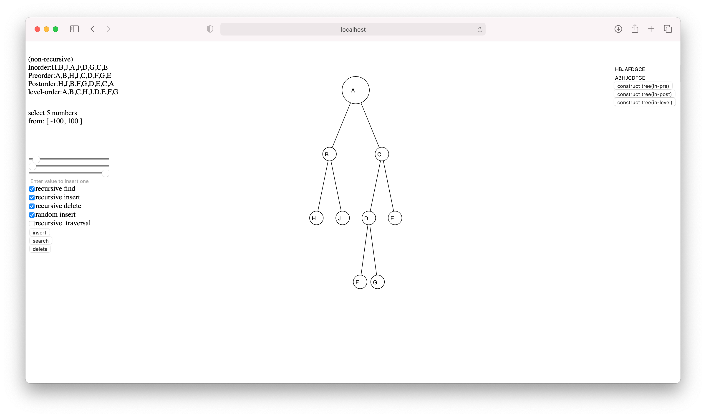
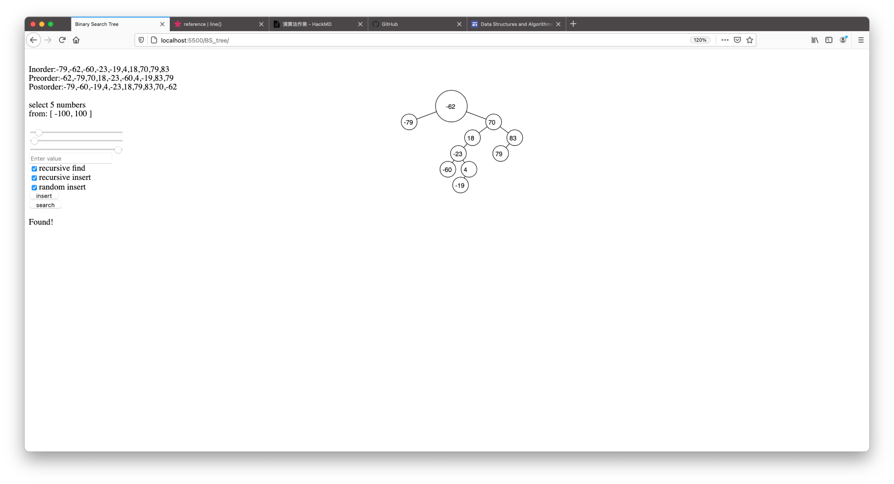
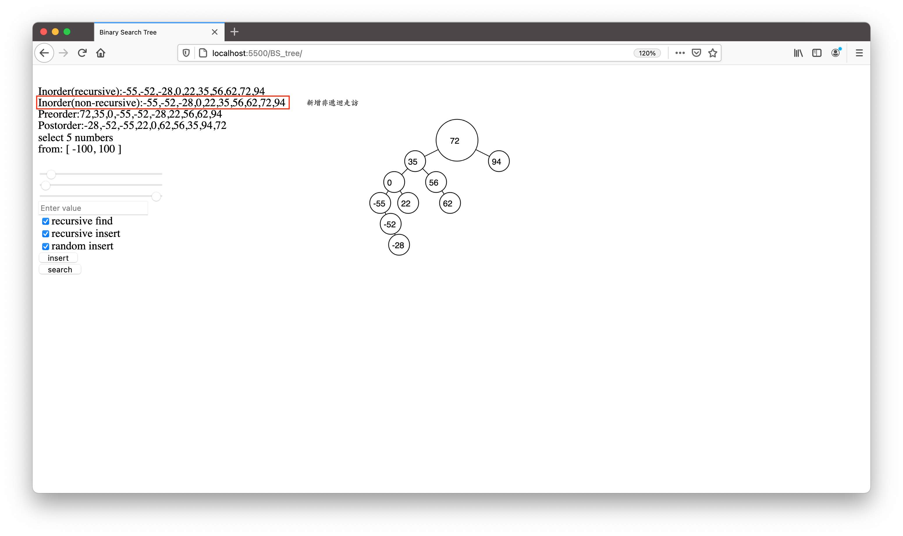
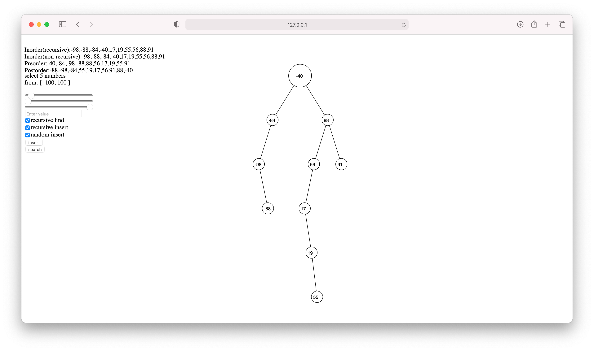
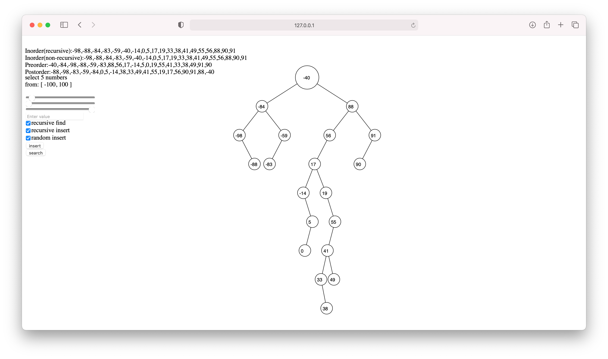
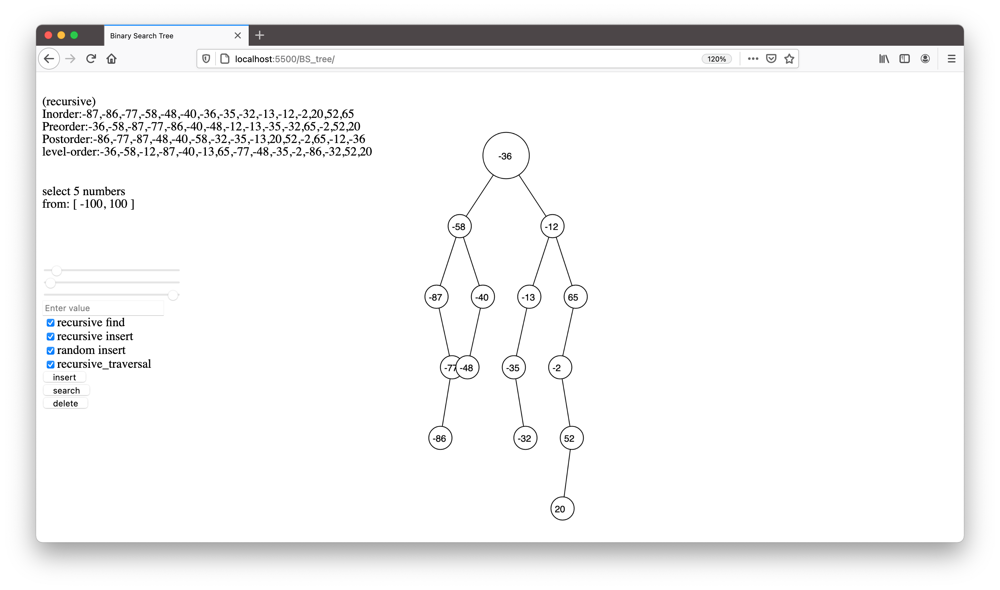
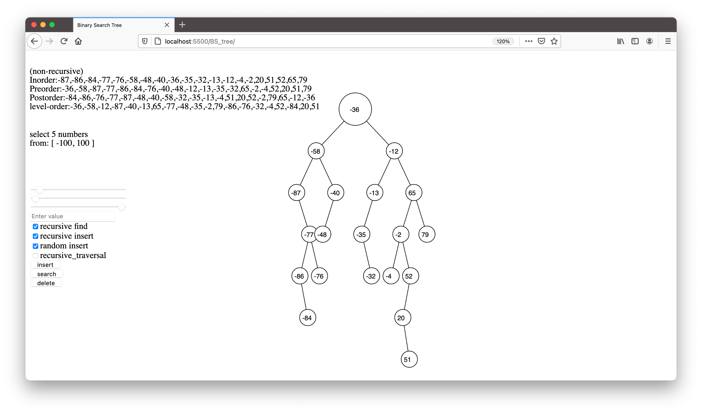

# Implement of Binary Search Tree


## 執行方式
1. 瀏覽器打開 [demo](http://alanhc.github.io/algorithm)
2. 使用本機查看
    * python3 : `python -m http.server`
    * python2 : `python -m SimpleHTTPServer`
    * nodejs : 
        * install: `npm install -g http-server`
        * run : `http-server`

## Usage
Using GUI
* Insert One data (Enter value or press insert button)
    
    

* Insert Many (Select random insert and press insert)

    
* Search  
  
    
Using Code
* Create a BS-tree 
```javascript 
let bst = new BinarySearchTree()
```
* Insert a Element 
    * using quick function
        ```javascript
        bst.insert(21, "r") 
        // 21:number to be insert, 
        // "r":recusive insert or set to 
        // "n" non-recusive insert 
        ```
    * directly insert
        ```javascript
        bst.insert_recursive(node, data)
        bst.insert_non_recursive(node, data)
        ```
## Todo
- [x] non-recursive-traversal(inorder, preorder, postorder)
- [x] recursive-traversal(inorder, preorder, postorder)
- [x] level-order-traversal
- [x] insert(recursive, non-recursive)
- [x] find(recursive, non-recursive)
- [x] delete
### HW2
- [x] inorder-non-recursive traversal
- [x] postorder-non-recursive traversal
- [x] preorder-non-recursive traversal
- [x] levelorder traversal
- [x] insert-non-recursive
- [x] delete-non-recursive(extra points)
- [x] search-non-recursive
- [x] determing a tree - infix-prefix
- [x] determing a tree - infix-postfix
- [x] determing a tree - infix-levelorder(extra points)


達成的功能
==============================

作業 1 : Binary Search Tree (BST) 的建置、查詢(Search)與走訪(Inorder)
作業 2 : 
 

功能需求 (可參考上課 powercam:二元樹的新增與走訪)：

- [x] 可 新增 一個整數資料 data (由使用者輸入) 進入 BST 中, 並且在新增完後以 "遞迴方式" 與 "非遞迴方式" 中序走訪BST，輸出中序走訪的數列 (應為排序後整數數列)；

- [x] 輸入一個整數資料 target (由使用者輸入)，並以 "遞迴方式" 與 "非遞迴方式" 查詢 target 是否存在BST中！

- [x] 可以 亂數新增 k 個整數資料，範圍在 0~range 之間 (range可自行定義)，並將這 k 個資料新增至 BST，全部新增完後，以中序走訪 BST 並輸出；

- [x] 以 "遞迴方式" 前序、中序、後序走訪BST並且輸出；

- [x] 適當扼要的註解 (comments)。

加分功能：

- [x] 若資料蒐尋無存在即新增進入BST;

- [x] BST 的資料內容可為字元 或 字串 (中序走訪的數列亦為排列者也)；

- [x] 友善的介面 (上課有提過的是其一也，可以自行發揮)；


==============================

功能需求 ：

- [x] 以 "非遞迴方式" 完成 "前序"、 "中序"、 "後序"走訪 BST 並且輸出；

- [x] 利用 "佇列" 進行 "階層" 走訪 BST 並且輸出 ；

- [x] 二元樹的 "新增" 、"搜尋" 和 "刪除" (加分項目)，以 "非遞迴" 的方式撰寫；

 決定唯一的二元樹：

給定 "中序式" 與 "前序式"，決定其二元樹；

給定 "中序式" 與 "後序式"，決定其二元樹；

給定 "中序式" 與 "階層走訪"，決定其二元樹 (加分項目)；

- [] 適當扼要的註解 (comments)。

完成基本要求 (上課提到的範疇, 與範例八九分相似), 從 65 分起跳。








