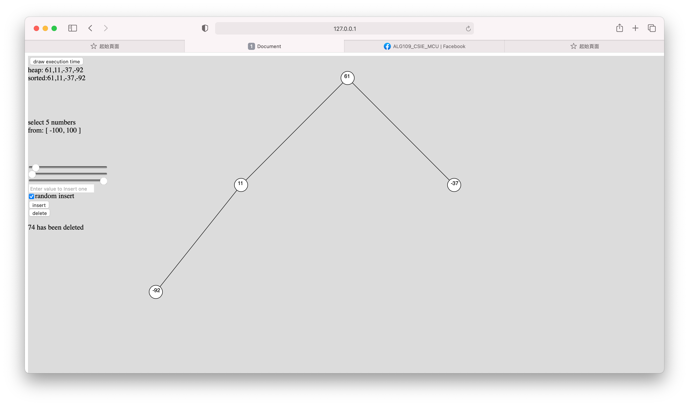
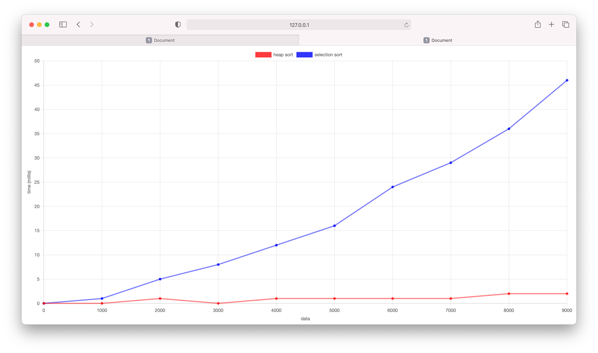

# Implement of MaxHeap and Heap sort

## 執行方式
1. 瀏覽器打開 [demo](http://alanhc.github.io/algorithm)
2. 使用本機查看
    * python3 : `python -m http.server`
    * python2 : `python -m SimpleHTTPServer`
    * nodejs : 
        * install: `npm install -g http-server`
        * run : `http-server`

